# StudyNow DevOps Engineer Assessment

This repository contains my solution for the **StudyNow DevOps Engineer Assessment**.

The project demonstrates containerized application deployment, database management, reverse proxy configuration, CI/CD automation, security controls, backup and disaster recovery, health monitoring, and operational documentation.

---

## 1. Project Overview

### Technologies

- Node.js
- Docker
- Docker Compose
- MongoDB 7
- Nginx
- GitHub Actions
- `mongodump` / `mongorestore`
- `age` encryption
- Git / GitHub

### Key Assessment Areas

- Docker containerization
- Node.js application
- MongoDB integration
- Nginx reverse proxy
- CI/CD using GitHub Actions
- Zero-downtime deployment approach
- MongoDB backup and restore
- Encrypted backups
- Disaster recovery validation
- RTO/RPO assessment
- Health monitoring
- Security and least-privilege configuration
- Deployment and recovery runbook

---

## 2. Architecture

```text
                         Client
                           |
                           v
                    +-------------+
                    |    Nginx    |
                    | Reverse     |
                    | Proxy       |
                    +------+------+
                           |
                           v
                    +-------------+
                    |  Node.js    |
                    | Application |
                    +------+------+
                           |
                           v
                    +-------------+
                    |  MongoDB 7  |
                    |   Database  |
                    +-------------+

                    Docker Compose
                    ───────────────
                    app + mongo + nginx

```

## 3. Project Structure

```text
studynow-devops-assessment/
│
├── app/
│   ├── package.json
│   └── src/
│       └── server.js
│
├── docker/
│   ├── mongo/
│   │   └── init-mongo.js
│   └── nginx/
│       └── nginx.conf
│
├── docs/
│   └── screenshots/
│
├── scripts/
│
├── .github/
│   └── workflows/
│       └── ci-cd.yml
│
├── .env.example
├── .gitignore
├── docker-compose.yml
└── README.md

```

## 4. Prerequisites

The following tools are required to run the project:

- Docker Desktop
- Docker Compose
- Git

### Verify Installation

| Tool           | Verification Command     |
| -------------- | ------------------------ |
| Docker         | `docker --version`       |
| Docker Compose | `docker compose version` |
| Git            | `git --version`          |

## 5. Configuration

The application configuration is managed using environment variables.

Sensitive credentials are not committed to the repository.

### Environment Variables

The following variables are used for MongoDB configuration:

| Variable                     | Purpose                         |
| ---------------------------- | ------------------------------- |
| `MONGO_INITDB_ROOT_USERNAME` | MongoDB administrative username |
| `MONGO_INITDB_ROOT_PASSWORD` | MongoDB administrative password |
| `MONGO_APP_USERNAME`         | Application database username   |
| `MONGO_APP_PASSWORD`         | Application database password   |

### Configuration Files

- `.env.example` – Contains the example configuration.
- `.env` – Contains local environment values and is excluded from Git.
- `.gitignore` – Prevents sensitive files and local artifacts from being committed.

> **Security:** Database passwords and other sensitive values should never be committed to the Git repository.

## 6. Application Deployment

The application is deployed using Docker Compose.

### Build and Start the Application

```bash
docker compose up -d --build

```

This command:

- Builds the application image.
- Creates the required Docker network.
- Starts the Node.js application.
- Starts MongoDB.
- Starts Nginx.

**Verify Running Services**

```bash
docker compose ps
```
The expected services are:

- studynow-app
- studynow-mongo
- studynow-nginx

**View Application Logs**

```bash
docker compose logs app
``` 
The application should start successfully and establish a connection with MongoDB.

## 7. Application Health

The application provides a health endpoint to verify application availability and MongoDB connectivity.

### Health Endpoint

```text
/health
```

**The health endpoint can be checked from inside the application container:**

```bash
docker exec studynow-app wget -q -O - http://127.0.0.1:3000/health
```

A healthy response is:

```text
{
  "status": "healthy",
  "database": "connected"
}
```

The Docker health check also validates the application health endpoint.

## 8. Nginx Reverse Proxy

Nginx is used as a reverse proxy in front of the Node.js application.

### Request Flow

```text
User / Browser
      |
      | HTTP :8080
      v
Nginx Reverse Proxy
      |
      | HTTP :3000
      v
Node.js Application
      |
      | MongoDB :27017
      v
MongoDB

```

The Nginx configuration is maintained in:

`docker/nginx/nginx.conf`

Nginx forwards incoming HTTP requests to the Node.js application running on the internal Docker network.

The application is accessed externally through:

`http://localhost:8080`

### Benefits

- Provides a single external entry point.
- Keeps the Node.js application behind the reverse proxy.
- Separates external traffic handling from the application service.
- Allows the application and database to communicate through the Docker network.

## 9. MongoDB

MongoDB 7 is used as the application's database.

MongoDB runs in a separate Docker container and communicates with the Node.js application through the internal Docker network.

### MongoDB Service

The MongoDB service is defined in:

```text
docker-compose.yml
```

MongoDB uses port:

`27017`

The database data is stored using a persistent Docker volume.

***Verify MongoDB***

Check the MongoDB container status:

```bash
docker compose ps mongo
```

View MongoDB logs:

```bash
docker compose logs mongo
```

## 10. Security and Least Privilege

The application follows a least-privilege approach for MongoDB access.

### MongoDB Application User

The application uses a dedicated MongoDB user instead of the MongoDB root user.

The application credentials are provided through:

```text
MONGO_APP_USERNAME
MONGO_APP_PASSWORD
```

### The MongoDB root credentials are reserved for administrative operations such as:

- Database administration
- Backup
- Restore
- Recovery operations

### Security Practices

- Database credentials are provided through environment variables.
- .env is excluded from Git.
- .secrets/ is excluded from Git.
- Database backups are excluded from Git.
- The application uses a dedicated MongoDB user.
- MongoDB root credentials are not used by the application.
- The application container is not directly exposed to the host.

## 11. CI/CD Pipeline

CI/CD is implemented using GitHub Actions to automate the application build and validation process.

### GitHub Actions Workflow

The workflow is located at:

```text
.github/workflows/ci-cd.yml
```

### The pipeline uses:

- GitHub Actions
- Docker
- Node.js
- Docker Compose

## 12. Zero-Downtime Deployment

The deployment process is designed to minimize application interruption during updates.

The application is deployed as a containerized service behind Nginx, while MongoDB runs as a separate persistent service.

### Deployment Flow

```text
Source Code Change
       |
       v
GitHub Repository
       |
       v
GitHub Actions
       |
       v
Build / Validate
       |
       v
Docker Image
       |
       v
Application Deployment
       |
       v
Health Validation

```

### Deployment Approach

- Application updates are performed independently from the MongoDB data layer.
- Nginx provides the external entry point for application traffic.
- Application health is validated after deployment.
- MongoDB data is maintained using a persistent Docker volume.
- Health validation helps confirm that the application is ready after deployment.

## 13. MongoDB Backup

MongoDB backups are created using `mongodump`.

The backup is stored as a compressed archive using the `.archive.gz` format.

### Backup Command

```bash
docker compose exec -T mongo sh -c 'mongodump --username "$MONGO_INITDB_ROOT_USERNAME" --password "$MONGO_INITDB_ROOT_PASSWORD" --authenticationDatabase admin --db studynow --archive --gzip' > backups/mongodb_restore_drill.archive.gz
```

### The command:

- Connects to the MongoDB container.
- Authenticates using the MongoDB administrative credentials.
- Creates a backup of the studynow database.
- Creates an archive using mongodump.
- Compresses the backup using gzip.
- Stores the backup under the backups/ directory.

### Backup Validation

The backup archive can be validated using:

```bash
gzip -t backups/mongodb_restore_drill.archive.gz
```
A successful command with no output indicates that the gzip archive is valid.

## 14. Encrypted Backups

Database backups contain application data and should be protected from unauthorized access.

The project uses `age` to encrypt MongoDB backup files.

### Backup Encryption Flow

```text
MongoDB
    |
    v
mongodump
    |
    v
Compressed Backup
    |
    v
Encryption using age
    |
    v
Encrypted Backup

```

### Encryption Benefits
- Protects backup data from unauthorized access.
- Prevents direct access to database contents from the backup file.
- Keeps encryption keys separate from the backup artifact.
- Prevents sensitive backup files from being committed to Git.

### Backup Security

Backup files are excluded from version control using .gitignore.

Encryption keys and other sensitive files are also kept outside the Git repository.

## 15. MongoDB Disaster Recovery Drill

A MongoDB disaster recovery drill was performed to validate the complete backup and restore process.

The drill simulated data loss and verified that the application data could be successfully recovered from a MongoDB backup.

### Recovery Process

```text
Create Test Data
       |
       v
Create MongoDB Backup
       |
       v
Validate Backup
       |
       v
Simulate Data Loss
       |
       v
Restore MongoDB Backup
       |
       v
Verify Restored Data

```

### 15.1 Test Data

A test document was created in the MongoDB notes collection.

The test document contained:
```text
{
    Title: DevOps Assessment Test
    Message: Backup and restore validation
}
```
The test data was used to verify that the backup and restore process recovered the expected application data.

### 15.2 Backup Creation

A fresh MongoDB backup was created immediately before the simulated data loss.

The backup was created as a compressed MongoDB archive:

`backups/mongodb_restore_drill.archive.gz`

### 15.3 Backup Validation

The backup archive was validated using:

```bash
gzip -t backups/mongodb_restore_drill.archive.gz
```
The validation completed successfully.

### 15.4 Data Loss Simulation

The studynow.notes collection was intentionally dropped to simulate database data loss.

After the simulated deletion, the document count was:
```text
0
```
This confirmed that the test data had been removed before starting the restore operation.

### 15.5 Restore Operation

The MongoDB backup was restored using mongorestore.

```bash
cat backups/mongodb_restore_drill.archive.gz | docker compose exec -T mongo sh -c 'mongorestore --username "$MONGO_INITDB_ROOT_USERNAME" --password "$MONGO_INITDB_ROOT_PASSWORD" --authenticationDatabase admin --gzip --archive --drop'
```
The restore completed successfully with:

```text
1 document(s) restored successfully.
0 document(s) failed to restore.
```

### 15.6 Restore Verification

After the restore operation, the notes collection was queried again.

The test document was successfully restored and the document count returned to:
```text
1
```
This confirmed that the MongoDB backup could successfully recover the test data after simulated data loss.

## 16. RTO and RPO

Recovery metrics were observed during the MongoDB disaster recovery drill.

### RPO — Recovery Point Objective

For this test, the MongoDB backup was created immediately before the simulated data loss.

The observed test RPO was approximately:

```text
~0 minutes
```
This value applies only to this test scenario.

In a production environment, the actual RPO would depend on the configured backup frequency.

### RTO — Recovery Time Objective

The observed MongoDB restore execution time for the test dataset was:

`Less than 1 second`

This measurement represents the database restore operation only.

It should not be interpreted as the complete application disaster recovery time.

A complete production recovery time could also include:

- Backup retrieval
- Backup decryption
- Database startup
- Restore preparation
- Application restart
- Health validation
- Traffic restoration
- Operational verification

Therefore, the observed result for this test was:

`Observed MongoDB restore execution time: < 1 second`

The result demonstrates that the documented MongoDB restore mechanism works successfully for the test dataset.

## 17. Disaster Recovery Validation

The disaster recovery drill validated the complete MongoDB backup and recovery workflow.

### Recovery Validation Results

| Validation Step | Result |
|---|---|
| Test data created | Successful |
| MongoDB backup created | Successful |
| Backup archive validated | Successful |
| Data loss simulated | Successful |
| MongoDB restore executed | Successful |
| Restore failures | 0 |
| Restored document count | 1 |
| Test restore execution time | < 1 second |

### Recovery Outcome

The test document was successfully recovered after simulated data loss.

This validates that the documented MongoDB backup and restore procedure can recover the test dataset successfully.

## 18. Monitoring and Health Checks

Application health is monitored using the application's health endpoint and Docker health checks.

### Application Health

The health endpoint verifies:

- Application availability
- MongoDB connectivity

The health status confirms that the application is running and able to communicate with the database.

### Docker Health Check

The application container uses a Docker health check to validate the application health endpoint.

The health check uses:

```text
http://127.0.0.1:3000/health
```

Check the health status using:

```bash
docker compose ps
```

The application container should report:
`healthy`

## 19. Useful Docker Commands

### Start the Environment

```bash
docker compose up -d
```
### Build and Start

```bash
docker compose up -d --build
```
### Check Running Services

```bash
docker compose ps
```
### View All Logs

```bash
docker compose logs
```
### View Application Logs

```bash
docker compose logs app
```
### Follow Application Logs

```bash
docker compose logs -f app
```
### Stop the Environment

```bash
docker compose down
```
### Stop the Environment and Remove Volumes

Warning: This removes persistent Docker volumes, including MongoDB data.

```bash
docker compose down -v
```
## 20. Troubleshooting

### Check Container Status

```bash
docker compose ps
```
### Check Application Logs

```bash
docker compose logs app
```
### Check MongoDB Logs

```bash
docker compose logs mongo
```
### Check Nginx Logs

```bash
docker compose logs nginx
```
### Check Application Health

```bash
docker exec studynow-app wget -q -O - http://127.0.0.1:3000/health
````
### Restart the Environment

```bash
docker compose down
docker compose up -d --build
```
### Check All Service Logs

```bash
docker compose logs
```
## 21. Assessment Evidence

The following screenshots provide evidence of the implemented DevOps, security, CI/CD, backup, and disaster recovery requirements.

### CI/CD

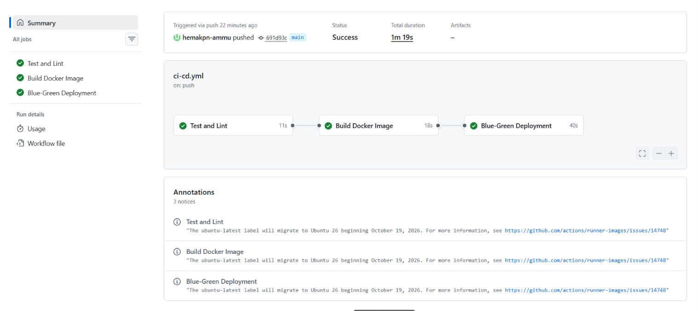

### Application and MongoDB Health

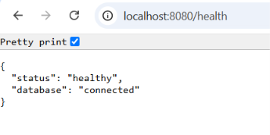

### Application Through Nginx

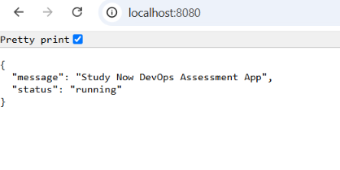

### Docker Compose Services

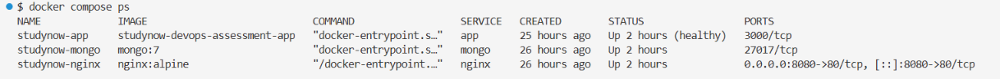

### MongoDB Least Privilege

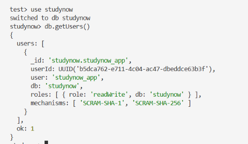

### MongoDB Test Data

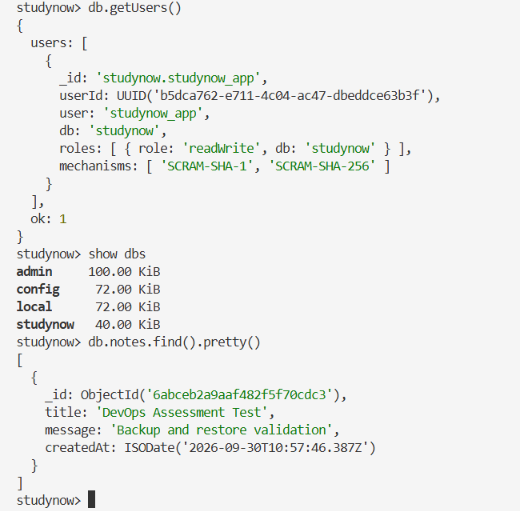

### MongoDB Backup

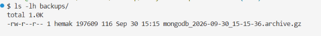

### Encrypted MongoDB Backup

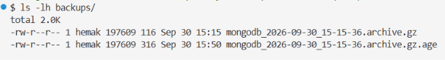

### Backup Restore Dry Run

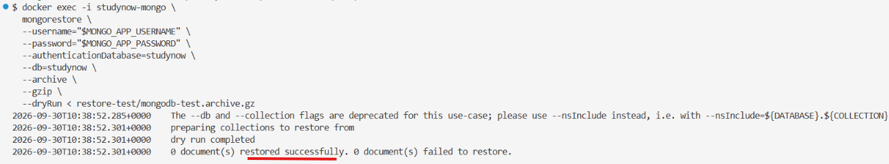

### Encrypted Backup With Test Data

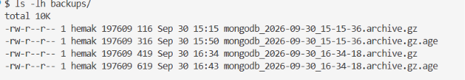

### MongoDB Restore Success

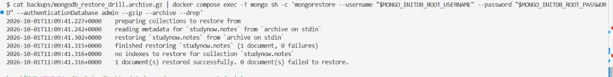

### MongoDB Restore Verification

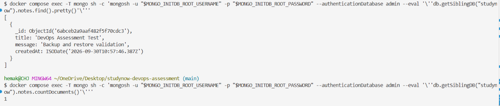

### MongoDB Data Loss Simulation

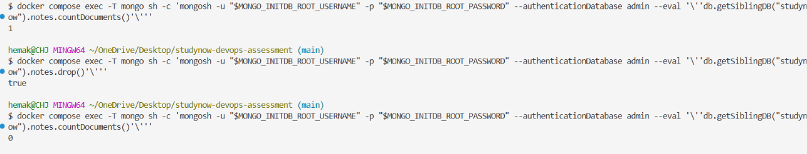

## 22. Cleanup

### Stop and remove the application containers and network:

```bash
docker compose down
```
### To also remove persistent Docker volumes:

```bash
docker compose down -v
```
> **Warning:** `docker compose down -v` removes persistent Docker volumes, including MongoDB data.

## 23. Conclusion

This project demonstrates an end-to-end DevOps workflow for a containerized application.

The implementation covers:

- Containerized application deployment
- MongoDB database integration
- Nginx reverse proxy
- Docker Compose orchestration
- CI/CD automation
- Application health checks
- Database least-privilege access
- MongoDB backup and encryption
- Disaster recovery validation
- Data-loss simulation
- Successful database restoration
- RTO/RPO measurement
- Operational documentation
- Assessment evidence

The disaster recovery drill demonstrates that application data can be backed up, intentionally removed, restored, and verified successfully using the documented recovery procedure.