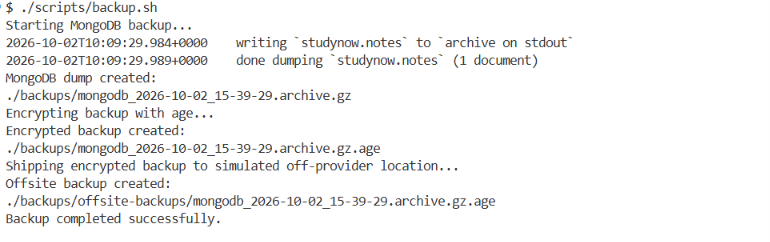
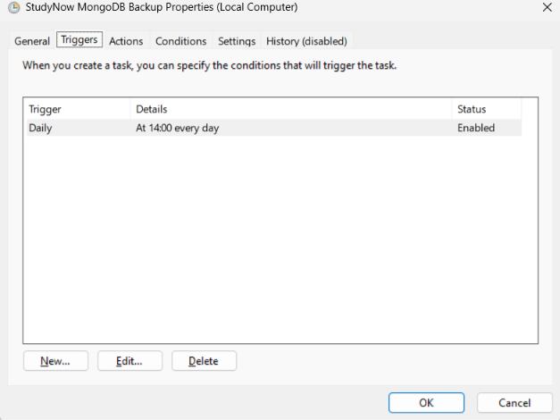
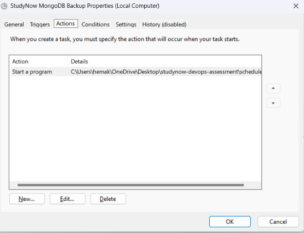
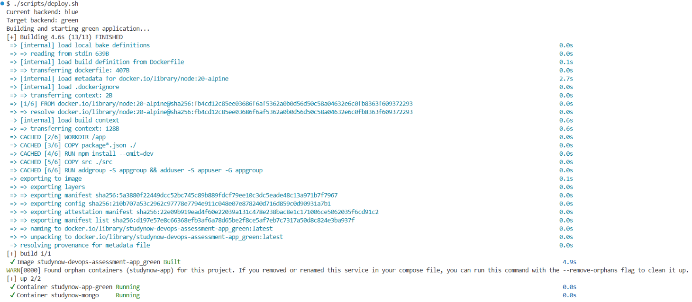
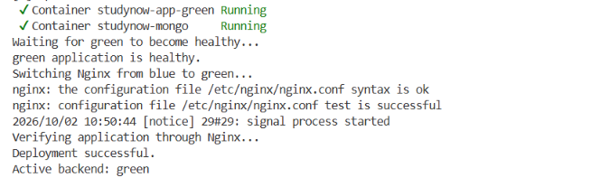
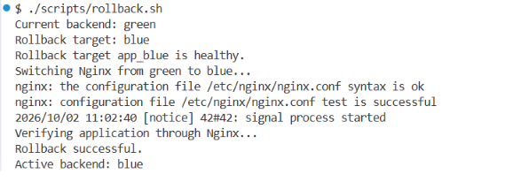
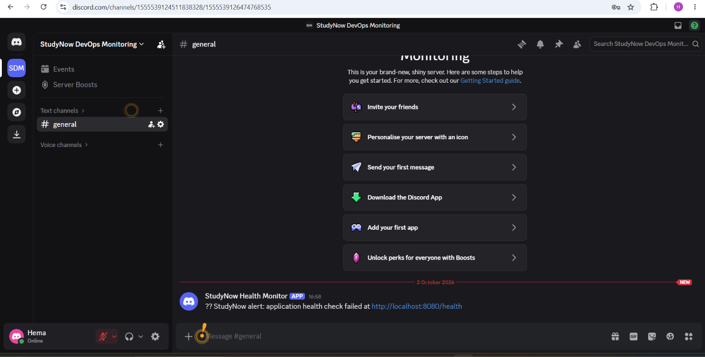
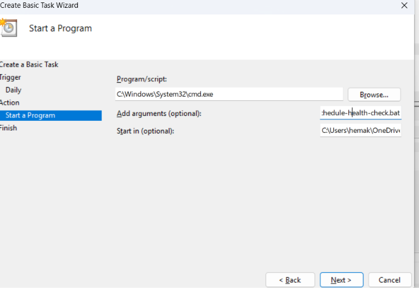
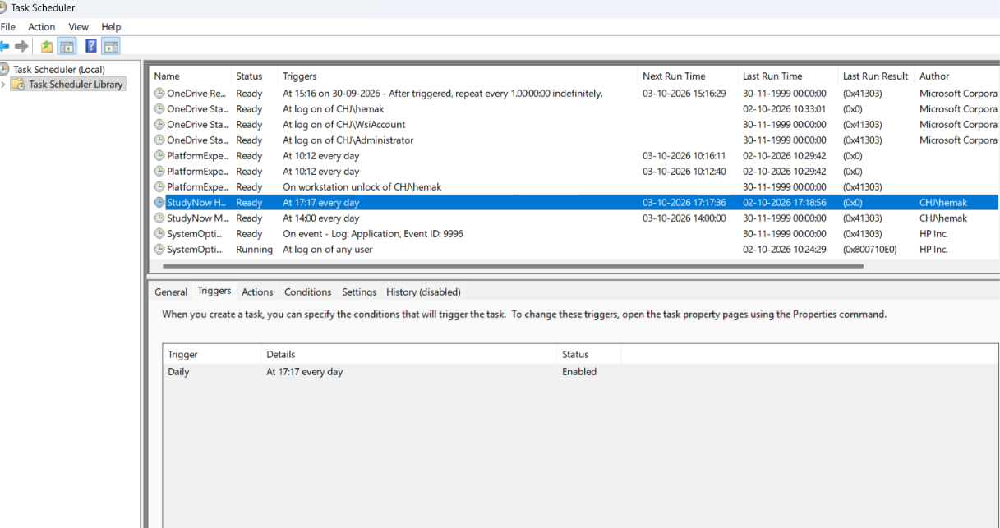
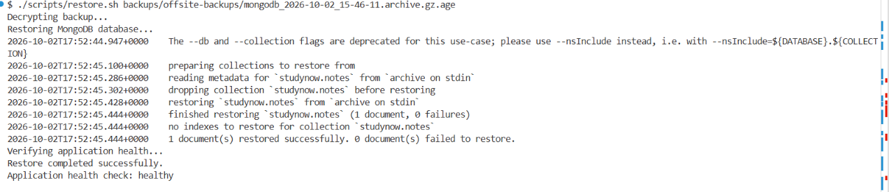

# StudyNow DevOps Engineer Assessment

This repository contains my solution for the **StudyNow DevOps Engineer Assessment**.

The project demonstrates containerized application deployment, database management, reverse proxy configuration, CI/CD automation, security controls, blue/green deployment, backup and disaster recovery, health monitoring, alerting, and operational documentation.

## 1. Project Overview

### Technologies

- Node.js
- Docker
- Docker Compose
- MongoDB 7
- Nginx
- GitHub Actions
- `mongodump` / `mongorestore`
- `age` encryption
- Git / GitHub
- Windows Task Scheduler
- Discord Webhook

### Key Assessment Areas

- Docker containerization
- Node.js application
- MongoDB integration
- Nginx reverse proxy
- CI/CD using GitHub Actions
- Blue/green zero-downtime deployment approach
- Deployment rollback
- MongoDB backup and restore
- Encrypted backups
- Offsite backup storage
- Scheduled backups
- Disaster recovery validation
- RTO/RPO assessment
- Application health monitoring
- Discord alerting
- Security and least-privilege configuration
- Deployment and recovery runbook

## 2. Architecture

```text
                         Client
                           |
                           v
                    +-------------+
                    |    Nginx    |
                    | Reverse     |
                    | Proxy       |
                    +------+------+
                           |
                +----------+----------+
                |                     |
                v                     v
        +-------------+       +-------------+
        | Node.js     |       | Node.js     |
        | App - Blue  |       | App - Green |
        +------+------+       +------+------+
                |                     |
                +----------+----------+
                           |
                           v
                    +-------------+
                    |  MongoDB 7  |
                    |  Database   |
                    +-------------+

                    Docker Compose
                    ───────────────
              Nginx + Blue + Green + MongoDB
```
Nginx routes traffic to one healthy application backend at a time.

## 3. Project Structure

```text
studynow-devops-assessment/
│
├── app/
│   ├── Dockerfile
│   ├── eslint.config.js
│   ├── package.json
│   ├── package-lock.json
│   ├── src/
│   │   └── server.js
│   └── test/
│       └── server.test.js
│
├── docker/
│   ├── mongo/
│   │   └── init-mongo.js
│   └── nginx/
│       ├── nginx.conf
│       └── active_backend
│
├── docs/
│   └── screenshots/
│
├── scripts/
│   ├── backup.sh
│   ├── deploy.sh
│   ├── health-check.sh
│   ├── restore.sh
│   └── rollback.sh
│
├── .github/
│   └── workflows/
│       └── ci-cd.yml
│
├── .env.example
├── .gitignore
├── docker-compose.yml
├── schedule-backup.bat
├── schedule-health-check.bat
└── README.md

```

## 4. Prerequisites

The following tools are required to run the project:

- Docker Desktop
- Docker Compose
- Git
- `age`
- `curl`

### Verify Installation

| Tool           | Verification Command     |
| -------------- | ------------------------ |
| Docker         | `docker --version`       |
| Docker Compose | `docker compose version` |
| Git            | `git --version`          |
| age            | `age --version`          |
| curl           | `curl --version`         |

## 5. Configuration

The application configuration is managed using environment variables.

Sensitive credentials and encryption keys are not committed to the repository.

### Environment Variables

The following variables are used by the application and supporting services:

| Variable                     | Purpose                                           |
| ---------------------------- | --------------------------------------------------|
| `MONGO_ROOT_USERNAME`        | MongoDB administrative username                   |
| `MONGO_ROOT_PASSWORD`        | MongoDB administrative password                   |
| `MONGO_APP_USERNAME`         | Application database username                     |
| `MONGO_APP_PASSWORD`         | Application database password                     |
| `MONGO_URI`                  | MongoDB connection string used by the application |
| `ALERT_WEBHOOK_URL`          | Discord webhook URL used for health-check alerts  |


### Configuration Files

- `.env.example` – Contains example configuration values.
- `.env` – Contains local environment values and is excluded from Git.
- `.secrets/backup-key.txt` – Contains the `age` private key used for backup encryption and is excluded from Git.
- `.gitignore` – Prevents sensitive files and local artifacts from being committed.

> **Security:** Database passwords, webhook URLs, encryption keys, and other sensitive values must never be committed to the Git repository.

## 6. Application Deployment

The application is deployed using Docker Compose with two Node.js application containers behind an Nginx reverse proxy.

### Build and Start the Application

```bash
docker compose up -d --build
```

This command:

- Builds the application images.
- Creates the required Docker network.
- Starts MongoDB.
- Starts the blue and green application containers.
- Starts Nginx.

### Verify Running Services
```bash
docker compose ps
```
The expected services are:

- `studynow-app-blue`
- `studynow-app-green`
- `studynow-mongo`
- `studynow-nginx`
- `View Application Logs`

### View Application Logs
To view logs for a specific application backend:

`docker compose logs app_<blue/green>`
The application containers should start successfully and establish a connection with MongoDB.

### Verify Application Through Nginx

```bash
curl http://localhost:8080/health
```
A healthy response indicates that the application is running and connected to MongoDB.

## 7. Application Health

The application provides a health endpoint to verify application availability and MongoDB connectivity.

### Health Endpoint

```text
/health
```

**The health endpoint can be checked from inside the application container:**

```bash
docker exec studynow-app-blue wget -q -O - http://127.0.0.1:3000/health
```

A healthy response is:

```text
{
  "status": "healthy",
  "database": "connected"
}
```

The Docker health check also validates the application health endpoint.

## 8. Nginx Reverse Proxy

Nginx is used as a reverse proxy in front of the Node.js application.

### Request Flow

```text
User / Browser
      |
      | HTTP :8080
      v
Nginx Reverse Proxy
      |
      | HTTP :3000
      v
Node.js Application
      |
      | MongoDB :27017
      v
MongoDB

```

The Nginx configuration is maintained in:

`docker/nginx/nginx.conf`

Nginx forwards incoming HTTP requests to the Node.js application running on the internal Docker network.

The application is accessed externally through:

`http://localhost:8080`

### Benefits

- Provides a single external entry point.
- Keeps the Node.js application behind the reverse proxy.
- Separates external traffic handling from the application service.
- Allows the application and database to communicate through the Docker network.

## 9. MongoDB

MongoDB 7 is used as the application's database.

MongoDB runs in a separate Docker container and communicates with the Node.js application through the internal Docker network.

### MongoDB Service

The MongoDB service is defined in:

```text
docker-compose.yml
```

MongoDB uses port:

`27017`

The database data is stored using a persistent Docker volume.

***Verify MongoDB***

Check the MongoDB container status:

```bash
docker compose ps mongo
```

View MongoDB logs:

```bash
docker compose logs mongo
```

## 10. Security and Least Privilege

The application follows a least-privilege approach for MongoDB access.

### MongoDB Application User

The application uses a dedicated MongoDB user instead of the MongoDB root user.

The application credentials are provided through:

```text
MONGO_APP_USERNAME
MONGO_APP_PASSWORD
```

### The MongoDB root credentials are reserved for administrative operations such as:

- Database administration
- Backup
- Restore
- Recovery operations

### Security Practices

- Database credentials are provided through environment variables.
- .env is excluded from Git.
- .secrets/ is excluded from Git.
- Database backups are excluded from Git.
- The application uses a dedicated MongoDB user.
- MongoDB root credentials are not used by the application.
- The application container is not directly exposed to the host.

## 11. CI/CD Pipeline

CI/CD is implemented using GitHub Actions to automate the application build and validation process.

### GitHub Actions Workflow

The workflow is located at:

```text
.github/workflows/ci-cd.yml
```
The workflow runs on every push to the repository.

### Pipeline Stages

The pipeline performs the following steps:

- Checkout the repository
- Set up Node.js 20
- Install dependencies using npm ci
- Run application tests
- Run ESLint
- Build the Docker image
- Verify the Docker image was created successfully

The Docker image build runs only after the test and lint stage succeeds.

#### Deployment Stage

After the Docker image build succeeds, the pipeline performs a blue-green deployment.

The deployment process:

- Starts the Docker Compose environment.
- Identifies the inactive application container.
- Builds and starts the target application container.
- Waits for the target container to become healthy.
- Switches Nginx traffic to the healthy container.
- Performs a health check through Nginx.
- Automatically restores the previous Nginx backend if the post-deployment health check fails.

This approach allows the new application version to become healthy before traffic is switched to it, reducing the risk of dropped requests during deployment.

### The pipeline uses:

- GitHub Actions
- Docker
- Node.js 20
- npm
- ESLint

## 12. Zero-Downtime Deployment

The application uses a local blue/green deployment strategy behind Nginx.

Two application containers are maintained:

```text
studynow-app-blue
studynow-app-green
```
Nginx routes traffic to only one active backend at a time.

### Deployment Flow

```text
Source Code Change
       |
       v
GitHub Actions
       |
       v
Test + Lint
       |
       v
Docker Image Build
       |
       v
Deploy Target Container
       |
       v
Health Check
       |
       v
Nginx Backend Switch
       |
       v
Public Health Check
```
### Blue/Green Deployment

The deployment script is:

```scripts/deploy.sh```

The script:

1. Detects the currently active backend.
2. Selects the inactive application container as the deployment target.
3. Builds and starts the target container.
4. Waits for the target container to become healthy.
5. Validates the Nginx configuration.
6. Reloads Nginx to switch traffic to the healthy target.
7. Verifies the application through the public Nginx endpoint.
8. Automatically restores the previous backend if the public health check fails.

The active backend is tracked in:

```docker/nginx/active_backend```

### Rollback

Rollback is implemented using:

```scripts/rollback.sh```

The rollback process:

- Identifies the currently active backend.
- Selects the previous backend as the rollback target.
- Confirms that the target container is healthy.
- Switches Nginx to the rollback target.
- Validates the Nginx configuration.
- Reloads Nginx.
- Verifies the application through the public health endpoint.

This provides a health-checked backend switch while keeping the existing application container available during the deployment.

The blue/green deployment and rollback were tested successfully using the local Docker Compose environment.

## 13. MongoDB Backup

MongoDB backups are automated using:
`scripts/backup.sh`

The backup process performs the following steps:

- Loads the MongoDB configuration from the local `.env` file.
- Runs `mongodump` against the `studynow` database.
- Compresses the archive using MongoDB's `gzip` option.
- Encrypts the backup using `age`.
- Removes the unencrypted backup.
- Copies the encrypted backup to `backups/offsite-backups/`.

The `backups/` directory and encryption key are excluded from Git.

### Run a Backup Manually

From the project root:

```bash
./scripts/backup.sh
```
Example backup location:
`backups/mongodb_<timestamp>.archive.gz.age`

The encrypted backup is also copied to:

`backups/offsite-backups/`

In a production environment, this location could be replaced by an S3-compatible bucket or a second host/provider.

### Scheduled Backups

Backups are scheduled using Windows Task Scheduler.

The scheduled task executes:

`schedule-backup.bat`

The batch file invokes:

`scripts/backup.sh`

This provides an automated daily MongoDB backup without requiring manual execution.

The local `backups/` directory is excluded from Git using `.gitignore`, so backup files are not committed to the repository.

## 14. Encrypted Backups

Backup files are encrypted using `age` before they are copied to the simulated offsite location.

The encryption key is stored locally at:

```text
.secrets/backup-key.txt
```
This directory is excluded from Git using `.gitignore`.

### Backup Encryption Flow

```text
MongoDB
   |
   v
mongodump
   |
   v
Compressed Archive
   |
   v
age Encryption
   |
   v
Encrypted Backup
   |
   v
Offsite Backup Directory
```
The unencrypted MongoDB archive is removed after successful encryption.

Only the encrypted `.age` backup is retained in the backup locations.

### Security Considerations

- MongoDB credentials are stored in `.env`.
- The backup encryption key is stored in `.secrets/`.
- `.env` and `.secrets/` are excluded from Git.
- Unencrypted backup files are not retained after successful encryption.
- The encryption key must be protected separately from the backup files.

To restore an encrypted backup, the corresponding `age` private key is required.

## 15. MongoDB Disaster Recovery Drill

A MongoDB restore drill was performed to validate that the backup could be used to recover application data.

### Restore Process

The restore procedure uses:

```text
scripts/restore.sh
```
The script accepts an encrypted backup file:

`./scripts/restore.sh backups/offsite-backups/<backup>.archive.gz.age`

The restore process:

- Loads the MongoDB configuration from .env.
- Decrypts the encrypted backup using the age private key.
- Restores the MongoDB archive using mongorestore.
- Replaces the existing database contents using the restore operation.
- Removes the temporary decrypted archive.
- Verifies application health through the Nginx endpoint.
- Disaster Recovery Drill

The restore drill included:

- Creating test data in MongoDB.
- Creating an encrypted MongoDB backup.
- Verifying that the encrypted backup was created successfully.
- Simulating MongoDB data loss by removing the test collection.
- Restoring the database from the backup.
- Verifying that the test data was recovered.
- Verifying that the application returned a healthy status after restoration.

The restore drill completed successfully and demonstrated that the encrypted backup could recover the application data.

### Recovery Process

```text
Create Test Data
       |
       v
Create MongoDB Backup
       |
       v
Validate Encrypted Backup
       |
       v
Simulate Data Loss
       |
       v
Restore MongoDB Backup
       |
       v
Verify Restored Data
       |
       v
Verify Application Health
```

### 15.1 Test Data

A test document was created in the MongoDB notes collection.

The test document contained:
```text
{
    Title: DevOps Assessment Test
    Message: Backup and restore validation
}
```
The test data was used to verify that the backup and restore process recovered the expected application data.

### 15.2 Backup Creation

A fresh MongoDB backup was created immediately before the simulated data loss.

The backup was created as a compressed MongoDB archive:

`backups/mongodb_<timestamp>.archive.gz.age`

### 15.3 Backup Validation

The backup archive was validated using:

```bash
gzip -t backups/mongodb_restore_drill.archive.gz
```
The validation completed successfully.

### 15.4 Data Loss Simulation

The studynow.notes collection was intentionally dropped to simulate database data loss.

After the simulated deletion, the document count was:
```text
0
```
This confirmed that the test data had been removed before starting the restore operation.

### 15.5 Restore Operation

The MongoDB backup was restored using mongorestore.

```bash
cat backups/mongodb_restore_drill.archive.gz | docker compose exec -T mongo sh -c 'mongorestore --username "$MONGO_INITDB_ROOT_USERNAME" --password "$MONGO_INITDB_ROOT_PASSWORD" --authenticationDatabase admin --gzip --archive --drop'
```
The restore completed successfully with:

```text
1 document(s) restored successfully.
0 document(s) failed to restore.
```

### 15.6 Restore Verification

After the restore operation, the notes collection was queried again.

The test document was successfully restored and the document count returned to:
```text
1
```
This confirmed that the MongoDB backup could successfully recover the test data after simulated data loss.

### 15.7 Application Health Verification

After the MongoDB restore, the application health endpoint was checked through Nginx:

```bash
curl http://localhost:8080/health
```
The health check returned a healthy status with the MongoDB connection established.

This confirmed that the application was healthy and successfully connected to the restored MongoDB database.

## 16. RTO and RPO

Recovery metrics were observed during the MongoDB disaster recovery drill.

### RPO — Recovery Point Objective

For this test, the MongoDB backup was created immediately before the simulated data loss.

The observed test RPO was approximately:

```text
~0 minutes
```
This value applies only to this test scenario.

In a production environment, the actual RPO would depend on the configured backup frequency.

### RTO — Recovery Time Objective

The observed MongoDB restore execution time for the test dataset was:

`Less than 1 second`

This measurement represents the database restore operation only.

It should not be interpreted as the complete application disaster recovery time.

A complete production recovery time could also include:

- Backup retrieval
- Backup decryption
- Database startup
- Restore preparation
- Application restart
- Application health verification
- Traffic restoration through Nginx

Therefore, the observed result for this test was:

`Observed MongoDB restore execution time: < 1 second`

The result demonstrates that the documented MongoDB restore mechanism works successfully for the test dataset.

## 17. Disaster Recovery Validation

The disaster recovery drill validated the complete MongoDB backup and recovery workflow.

### Recovery Validation Results

| Validation Step | Result |
|---|---|
| Test data created | Successful |
| MongoDB backup created | Successful |
| Backup archive validated | Successful |
| Data loss simulated | Successful |
| MongoDB restore executed | Successful |
| Restore failures | 0 |
| Restored document count | 1 |
| Test restore execution time | <1 second |
| Application health after restore | Healthy |

The application health endpoint returned:

```markdown
| Application health after restore | Healthy |
```
`This confirmed that the restored MongoDB data was available and the application successfully reconnected to the database after the recovery operation.`

### Recovery Outcome

The test document was successfully recovered after simulated data loss.

This validates that the documented MongoDB backup and restore procedure can recover the test dataset successfully.

## 18. Monitoring and Health Checks

The application is monitored using a scheduled health-check script and a Discord webhook alert.

### Scheduled Health Check

The monitoring script is:

```text
scripts/health-check.sh
```
It checks the public application endpoint through Nginx:
`http://localhost:8080/health`

The script:

- Checks application availability.
- Verifies that the application reports a healthy MongoDB connection.
- Returns a failure status if the health check fails.
- Sends an alert to Discord when a failure is detected.

***Alerting***

A Discord webhook is configured through the environment variable:

`ALERT_WEBHOOK_URL`

The webhook URL is stored only in `.env` and is not committed to Git.

When the health check fails, a Discord alert is sent to the configured monitoring channel.

### Scheduled Monitoring

The health check is scheduled using Windows Task Scheduler.

The scheduled task executes:
`schedule-health-check.bat`

which runs:
`scripts/health-check.sh`

The scheduled task was manually triggered and completed successfully.

### Docker Health Checks

The application containers also use Docker health checks against:

`http://127.0.0.1:3000/health`

Container health can be inspected using:
`docker compose ps`

This provides two levels of monitoring:

- Docker health checks for container-level health.
- Scheduled external health checks with Discord alerting for application availability.

## 19. Useful Docker Commands

### Start the Environment

```bash
docker compose up -d
```
### Build and Start

```bash
docker compose up -d --build
```
### Check Running Services

```bash
docker compose ps
```
### View All Logs

```bash
docker compose logs
```
### View Application Logs

```bash
docker compose logs app_blue
docker compose logs app_green
```
### Follow Application Logs

```bash
docker compose logs -f app_blue
docker compose logs -f app_green
```
### View MongoDB Logs
```bash
docker compose logs mongo
```
### View Nginx Logs
```bash
docker compose logs nginx
```
### Stop the Environment

```bash
docker compose down
```
### Stop the Environment and Remove Volumes

Warning: This removes persistent Docker volumes, including MongoDB data.

```bash
docker compose down -v
```
### Deploy Using Blue/Green Strategy
```bash
./scripts/deploy.sh
```
### Roll Back the Deployment
```bash
./scripts/rollback.sh
```
## 20. Troubleshooting

### Application Is Not Reachable

Check the services:

```bash
docker compose ps
```
Check application health:

`curl http://localhost:8080/health`

If the application is unhealthy, check the active backend logs:

`docker compose logs app_<blue/green>`

### Nginx Is Not Serving Traffic

Check Nginx status and logs:

```bash
docker compose ps nginx
docker compose logs nginx
```
Verify the active backend:

```bash
cat docker/nginx/active_backend
```
### Bad Deployment

If a newly deployed version causes problems, roll back to the previous healthy backend:

```bash
./scripts/rollback.sh
```
### MongoDB Recovery

If MongoDB data is lost, follow the restore procedure:

`./scripts/restore.sh <encrypted-backup-file>`

After recovery, verify:

```bash
curl http://localhost:8080/health
```
### Restart the Environment

If the environment requires a full restart:

```bash
docker compose down
docker compose up -d --build
```
## 21. Assessment Evidence

The following screenshots provide evidence of the implemented DevOps, security, CI/CD, backup, disaster recovery, deployment, rollback, and monitoring requirements.

### CI/CD


Shows the GitHub Actions pipeline completing successfully, including testing, linting, Docker image build, and blue-green deployment.

### Application and MongoDB Health


Shows the application health endpoint reporting that the application is healthy and connected successfully to MongoDB.

### Application Through Nginx


Shows the application being accessed successfully through the Nginx reverse proxy.

### Docker Compose Services


Shows the Docker Compose environment running the application, MongoDB, and Nginx services.

### MongoDB Least Privilege


Shows the MongoDB application user configured with `readWrite` access only to the `studynow` database.

### MongoDB Test Data


Shows the test document stored in MongoDB before the backup and restore drill.

### MongoDB Backup


Shows the MongoDB backup being created successfully as a compressed archive.

### Encrypted MongoDB Backup


Shows the MongoDB backup being encrypted using `age`, protecting the backup data before storage.

### Backup Restore Dry Run


Shows the initial restore validation performed against the MongoDB backup before the final restore drill.

### Encrypted Backup With Test Data


Shows an encrypted backup created after inserting test data, providing a backup containing data that can be validated during restoration.

### MongoDB Restore Success


Shows the MongoDB restore operation completing successfully and restoring the test data.

### MongoDB Restore Verification


Shows verification that the restored MongoDB data is available after the restore operation.

### MongoDB Data Loss Simulation


Shows the intentional removal of test data used to simulate a database data-loss scenario before performing the restore drill.

### Encrypted Offsite Backup



Shows the MongoDB backup being encrypted using `age` and copied to the simulated offsite backup location.

### Scheduled Backup Trigger



Shows the Windows Task Scheduler configuration for the scheduled MongoDB backup.

### Scheduled Backup Task Configuration



Shows the configured Task Scheduler action used to execute the MongoDB backup script.

### Blue/Green Deployment Health



Shows the target application container becoming healthy before Nginx traffic is switched to it.

### Blue/Green Deployment Success



Shows the blue-green deployment completing successfully and the application being verified through Nginx.

### Rollback Success



Shows the rollback script successfully switching Nginx traffic back to the previous healthy application container.

### Monitoring Alert



Shows the application health check detecting a failure and sending an alert notification through Discord.

### Scheduled Health Check Configuration



Shows the configured Task Scheduler action used to execute the application health-check script.

### Scheduled Health Check Execution



Shows the scheduled application health check completing successfully.

#### Restore Script Success



Shows the encrypted MongoDB backup being decrypted and restored successfully, followed by a healthy application health check.

## 22. Cleanup

### Stop and remove the application containers and network:

```bash
docker compose down
```
This stops and removes the application, MongoDB, and Nginx containers and the Docker network. Persistent MongoDB data remains stored in the Docker volume.

### To also remove persistent Docker volumes:

```bash
docker compose down -v
```
> **Warning:** `docker compose down -v` removes persistent Docker volumes, including MongoDB data. Use this only when a complete environment reset is required.

## 23. Conclusion

This project demonstrates a practical DevOps workflow for a containerized application using Docker, MongoDB, Nginx, and GitHub Actions.

The implementation covers:

- Containerized application deployment
- MongoDB integration with least-privilege access
- Nginx reverse proxy
- Docker Compose orchestration
- CI/CD automation with testing, linting, and Docker image builds
- Blue/green deployment with health-checked traffic switching
- Deployment rollback
- Application health checks and Discord alerting
- Scheduled MongoDB backups
- Encrypted and offsite backup storage
- Disaster recovery and restore validation
- Data-loss simulation
- RTO/RPO measurement
- Operational troubleshooting and runbook documentation
- Assessment evidence

The disaster recovery drill demonstrated that application data could be backed up, encrypted, stored in an offsite location, intentionally removed, restored, and verified successfully. The blue/green deployment and rollback procedures were also tested successfully, providing a documented approach for deploying and recovering the application with minimal service interruption. Application health monitoring and Discord alerting were validated to provide notification when the health check fails.